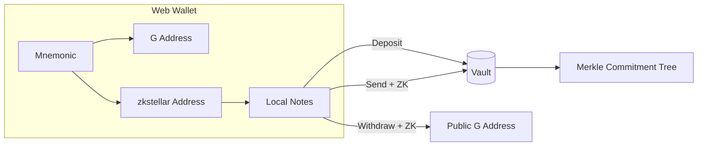

# zk-utxo

**UTXO-style private payments on Stellar** — arbitrary amounts, Sapling-style notes, 4×4 action bundles, UltraHonk zero-knowledge proofs.

**Hackathon:** [Stellar Hacks: Real-World ZK](https://dorahacks.io/hackathon/stellar-hacks-zk/detail)  
**Category:** Wild — UTXO-style private payment system

> **Docs:** [English README](./README.en.md) · [中文 README](./README.md)

## What It Is

Users deposit XLM into a Soroban **Vault** and receive local **shielded notes** (only Merkle commitments on-chain). Then they can:

- **Send** — private in-pool transfers to `zkstellar1…` addresses (ZK proof, amounts hidden)
- **Withdraw** — spend notes and receive public XLM at a `G…` address

One BIP39 mnemonic controls both the Stellar account and shielded keys. The web wallet signs transactions and generates proofs in the browser.

## Architecture at a Glance



**Full technical documentation (Deposit / Send / Withdraw flows, diagrams, implementation details):**  
👉 **[docs/architecture.en.md](docs/architecture.en.md)**

## Status

| Component | Status |
|-----------|--------|
| `utxo_actions` circuit (4×4 + diversifier) | ✅ |
| `note_hash` / `hash_pair` | ✅ |
| Unified web wallet (mnemonic + passkey + `zkstellar…`) | ✅ |
| Soroban Vault + UltraHonk Verifier | ✅ |
| Deposit / Send / Withdraw UI | ✅ |
| Relayer exit + E2E | ✅ |
| Testnet deployment | ✅ [deploy.md](docs/deploy.md) |

## Quick Start

### Circuits & Contracts

```bash
cd circuits/utxo_actions && nargo test
cd contracts && cargo test -p vault
```

### Web Wallet

```bash
cd web && npm install && npm run dev
```

On the **Notes** tab: create wallet → unlock with passkey → **Open wallet** → use Deposit / Send / Withdraw.

After deploy, set `web/.env.local`:

```env
NEXT_PUBLIC_VAULT_CONTRACT_ID=<vault contract id>
```

### Testnet Deploy

```bash
STELLAR_SOURCE=admin ./scripts/deploy_testnet.sh          # MockVerifier (demo)
STELLAR_SOURCE=admin ./scripts/deploy_testnet.sh --real-zk # UltraHonk + utxo_actions VK
```

### E2E (No Browser)

```bash
ZK_MOCK_PROOF=true STELLAR_SOURCE=admin ./scripts/e2e_testnet.sh --flow withdraw
ZK_MOCK_PROOF=true STELLAR_SOURCE=alice ./scripts/e2e_testnet.sh --flow send
ZK_MOCK_PROOF=true STELLAR_SOURCE=alice ./scripts/e2e_testnet.sh --flow full
```

## Documentation

| Doc | Content |
|-----|---------|
| [architecture.en.md](docs/architecture.en.md) | **Architecture, cryptography, Deposit/Send/Withdraw (English)** |
| [demo-video-script-4min.md](docs/demo-video-script-4min.md) | **4-min demo script (primary — use this)** |
| [demo-video-script.md](docs/demo-video-script.md) | Full demo script + 6–8 min walkthrough |
| [architecture.md](docs/architecture.md) | 系统架构与操作详解（中文） |
| [key-derivation.md](docs/key-derivation.md) | Mnemonic → G address + shielded keys |
| [deploy.md](docs/deploy.md) | Testnet deploy & VK updates |

## Repository Layout

```
circuits/          Noir circuits
contracts/         Soroban Vault + Verifier
web/               Next.js wallet
packages/wallet-core/  Shared key logic
scripts/e2e/       End-to-end tests
scripts/relayer/   Relayer exit service
```

## License

Apache-2.0
