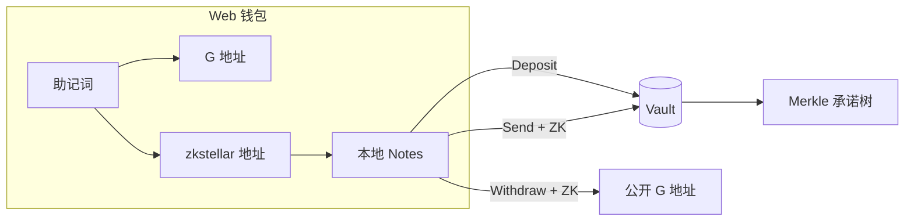

# zk-utxo

Stellar 上的 **UTXO 风格隐私支付**：任意金额、Sapling 式 note、4×4 动作束、UltraHonk 零知识证明。

**Hackathon:** [Stellar Hacks: Real-World ZK](https://dorahacks.io/hackathon/stellar-hacks-zk/detail)  
**Category:** Wild — UTXO-style private payment system

> **文档 / Docs:** [中文 README](./README.md) · [English README](./README.en.md)

## 是什么

用户将 XLM 存入 Soroban **Vault**，获得本地 **shielded note**（链上只有 Merkle 承诺）。之后可以：

- **Send** — 在池内隐私转账给 `zkstellar1…` 地址（ZK 证明，不暴露金额）
- **Withdraw** — 花费 note，取回公开 XLM 到 `G…` 地址

一份 BIP39 助记词同时控制 Stellar 账户与隐私密钥；Web 钱包在浏览器内完成签名与证明。

## 架构一图



**详细技术文档（含 Deposit / Send / Withdraw 流程图与实现细节）：**  
👉 **[docs/architecture.md](docs/architecture.md)**（中文） · **[docs/architecture.en.md](docs/architecture.en.md)**（English）

## 状态

| 组件 | 状态 |
|------|------|
| `utxo_actions` 电路（4×4 + diversifier） | ✅ |
| `note_hash` / `hash_pair` | ✅ |
| 统一 Web 钱包（助记词 + passkey + `zkstellar…`） | ✅ |
| Soroban Vault + UltraHonk Verifier | ✅ |
| Deposit / Send / Withdraw UI | ✅ |
| Relayer 退出 + E2E | ✅ |
| Testnet 部署 | ✅ [deploy.md](docs/deploy.md) |

## 快速开始

### 电路与合约

```bash
cd circuits/utxo_actions && nargo test
cd contracts && cargo test -p vault
```

### Web 钱包

```bash
cd web && npm install && npm run dev
```

在 **Notes** 页创建钱包 → passkey 解锁 → **Open wallet** → 使用 Deposit / Send / Withdraw。

部署后配置 `web/.env.local`：

```env
NEXT_PUBLIC_VAULT_CONTRACT_ID=<vault contract id>
```

### Testnet 部署

```bash
STELLAR_SOURCE=admin ./scripts/deploy_testnet.sh          # MockVerifier（演示）
STELLAR_SOURCE=admin ./scripts/deploy_testnet.sh --real-zk # UltraHonk + utxo_actions VK
```

### E2E（无浏览器）

```bash
ZK_MOCK_PROOF=true STELLAR_SOURCE=admin ./scripts/e2e_testnet.sh --flow withdraw
ZK_MOCK_PROOF=true STELLAR_SOURCE=alice ./scripts/e2e_testnet.sh --flow send
ZK_MOCK_PROOF=true STELLAR_SOURCE=alice ./scripts/e2e_testnet.sh --flow full
```

## 文档

| 文档 | 内容 |
|------|------|
| [architecture.md](docs/architecture.md) | 系统架构、密码学、Deposit/Send/Withdraw 详解（中文） |
| [architecture.en.md](docs/architecture.en.md) | **Architecture & operations (English — for demo)** |
| [demo-video-script-4min.md](docs/demo-video-script-4min.md) | **4 分钟 Demo 脚本（主版本）** |
| [demo-video-script.md](docs/demo-video-script.md) | 完整 Demo 脚本 + 6–8 分钟版 |
| [key-derivation.md](docs/key-derivation.md) | 助记词 → G 地址 + shielded 密钥 |
| [deploy.md](docs/deploy.md) | Testnet 部署与 VK 更新 |

## 仓库结构

```
circuits/          Noir 电路
contracts/         Soroban Vault + Verifier
web/               Next.js 钱包
packages/wallet-core/  共享密钥逻辑
scripts/e2e/       端到端测试
scripts/relayer/   Relayer 退出服务
```

## License

Apache-2.0
