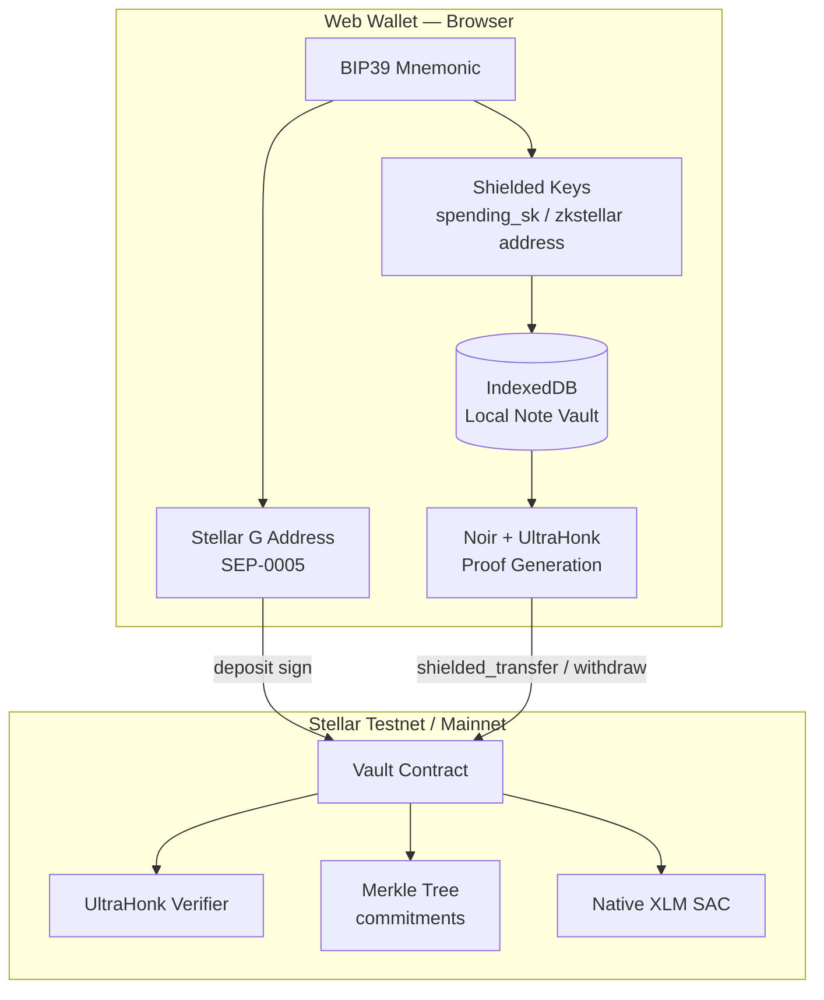
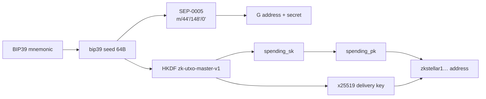
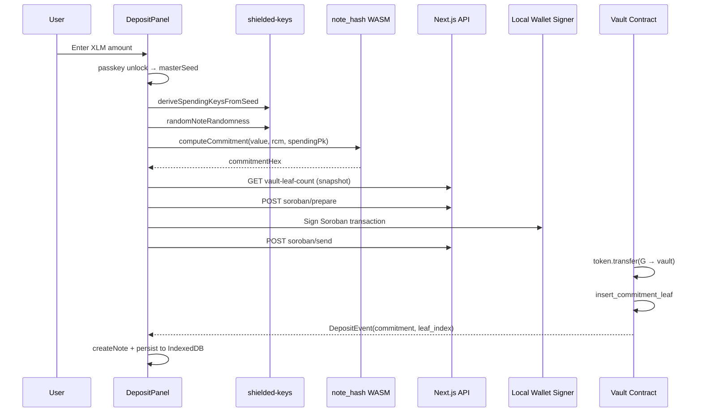
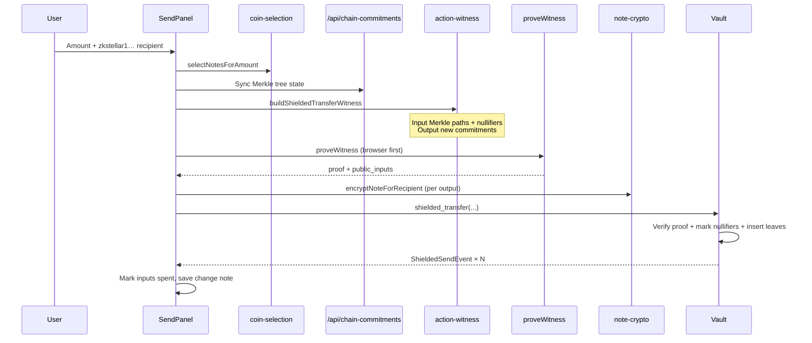
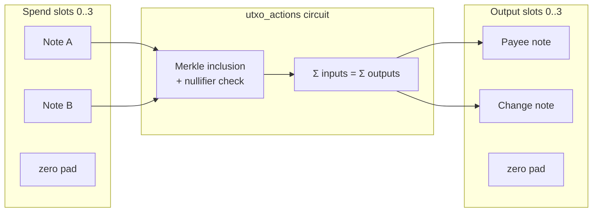
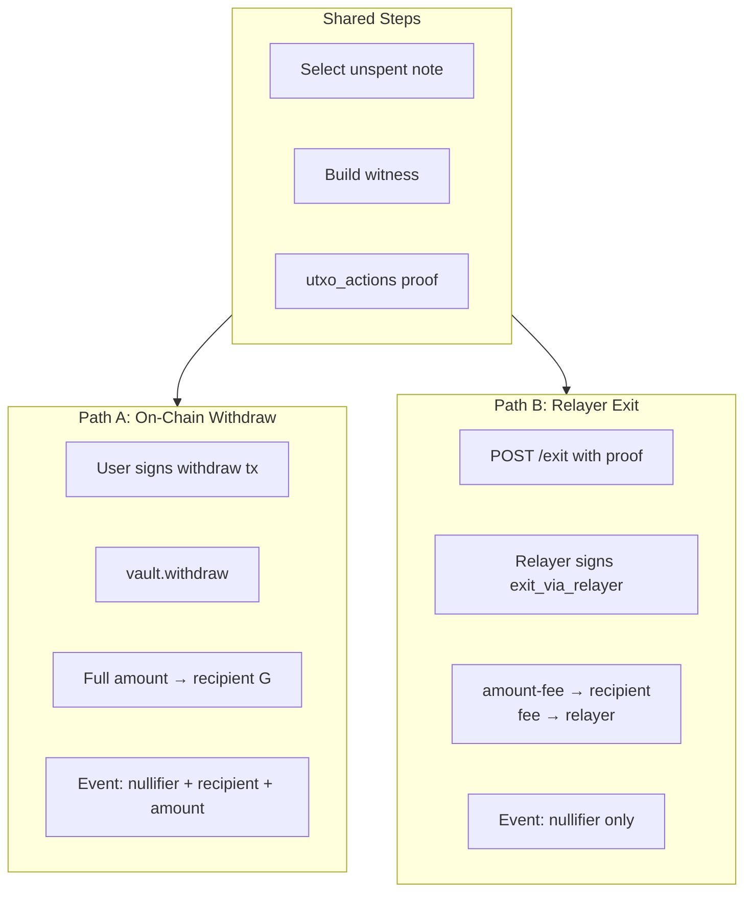
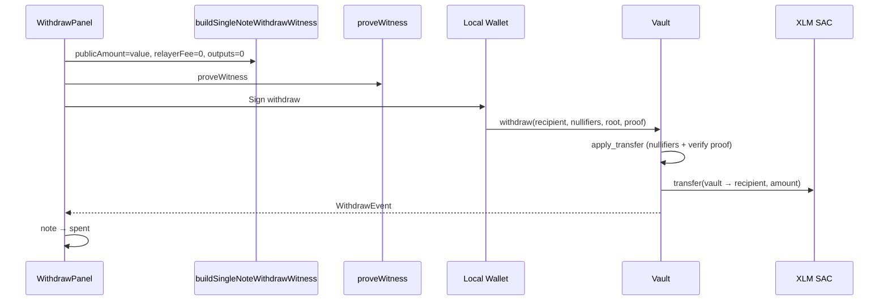
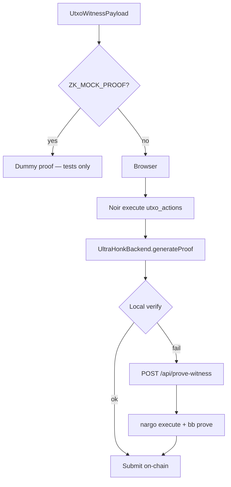

# zk-utxo — Technical Architecture & Operations

> **Languages:** [English](./architecture.en.md) · [中文](./architecture.md)

This document explains how zk-utxo implements UTXO-style private payments on Stellar: system components, cryptographic primitives, and end-to-end flows for **Deposit**, **Send**, and **Withdraw**.

---

## 1. System Overview

zk-utxo deposits public XLM into a Soroban **Vault** contract and maintains a global **Merkle commitment tree** on-chain (height 16, up to 65,536 leaves). Each **note** maps to one leaf; the leaf stores only a **commitment** hash — not the amount or owner.

To spend a note, the prover submits an **UltraHonk ZK proof** (`utxo_actions` circuit). After verification, the contract:

- Marks input **nullifiers** as spent (double-spend prevention)
- Inserts new commitments into the Merkle tree (**Send** path)
- Or pays out public XLM to a `G…` address (**Withdraw** path)



### 1.1 Repository Layout

| Directory | Purpose |
|-----------|---------|
| `circuits/` | Noir circuits: `note_hash`, `hash_pair`, `utxo_actions` |
| `contracts/contracts/vault/` | Soroban Vault: deposits, Merkle tree, nullifier set |
| `contracts/contracts/ultrahonk-verifier/` | On-chain UltraHonk verifier |
| `web/` | Next.js wallet UI + API + in-browser proving |
| `packages/wallet-core/` | Shared key derivation and address codec |
| `scripts/e2e/` | Headless end-to-end tests |
| `scripts/relayer/` | Relayer exit HTTP service |

### 1.2 Circuits

| Circuit | Role | ZK proof required? |
|---------|------|-------------------|
| `hash_pair` | Poseidon2 pair hash (`spending_pk`, nullifier, etc.) | No (browser/server execute) |
| `note_hash` | 3-input commitment `Poseidon2(value, rcm, pk)` | No (computed locally at deposit) |
| `utxo_actions` | 4×4 action bundle: spends + outputs + public amount | **Yes** (Send / Withdraw) |

---

## 2. Cryptography & Data Structures

### 2.1 Unified Mnemonic

One **24-word BIP39** mnemonic derives both:

- **Transparent layer:** Stellar `G…` account (`m/44'/148'/0'`, SEP-0005) — fees and Soroban tx signing
- **Shielded layer:** shielded master seed (HKDF, domain-separated from BIP44) — note keys and `zkstellar1…` receive addresses

See [key-derivation.md](./key-derivation.md).



### 2.2 Note (Local UTXO)

A note is stored locally in the wallet; **full plaintext never goes on-chain**.

| Field | Description |
|-------|-------------|
| `value` | Amount in stroops (1 XLM = 10⁷ stroops) |
| `noteRandomness` | Randomness `rcm` (BN254 field element) |
| `spendingPk` | Owner public key (bound in commitment) |
| `diversifier` | Payment address index; `"0"` for self-deposits |
| `commitment` | 32-byte hex with `0x` prefix |
| `leafIndex` | Position in the global Merkle tree |
| `status` | `unspent` / `spent` |

Defined in `web/src/lib/note-types.ts`, persisted in IndexedDB (`zk-utxo:vault:{G-address}`).

### 2.3 Commitment (On-Chain Leaf)

```
commitment = Poseidon2(value, note_randomness, recipient_pk)
```

- `recipient_pk` = diversified receive public key (`diversifier = 0` → `spending_pk`)
- Circuit: `circuits/note_hash/src/main.nr`
- On-chain: 32-byte BN254 field element only

### 2.4 Nullifier (Double-Spend Prevention)

```
spending_pk  = Poseidon2(spending_sk, 1)
recipient_pk = diversified_pk(spending_pk, diversifier)
commitment   = Poseidon2(value, rcm, recipient_pk)
nk           = Poseidon2(spending_sk, 2)
nullifier    = Poseidon2(nk, commitment)
```

- Computing a **nullifier requires `spending_sk`** — a sender who knows a recipient’s commitment cannot spend it (Sapling-style)
- The contract stores non-zero nullifiers; reuse triggers `panic!("nullifier spent")`

### 2.5 Shielded Receive Address `zkstellar1…`

Bech32m encoding (HRP = `zkstellar`), 76-byte payload:

| Part | Size |
|------|------|
| version | 1 B |
| diversifier | 11 B |
| recipient_pk | 32 B |
| x25519 pubkey | 32 B |

`recipient_pk` is bound in the ZK output commitment; `x25519` is used only for **on-chain note ciphertext** (recipient decrypts after Send) and is not a circuit public input.

### 2.6 `utxo_actions` Public Inputs (11 × 32 = 352 bytes)

```
merkle_root
| nullifier[0..3]       — 4 spend slots, unused = 0
| new_commitment[0..3]  — 4 output slots, unused = 0
| public_amount         — public payout (0 for Send)
| relayer_fee           — relayer fee (0 for Send)
```

Layout matches `contracts/contracts/vault/src/verifier.rs`. Proof size: **456 × 32 = 14,592 bytes** (UltraHonk).

---

## 3. Deposit (Shield Public XLM)

Move public XLM into the Vault and receive a local shielded note. **No ZK proof at this step.**

### 3.1 Sequence Diagram



### 3.2 Step-by-Step

| Step | Implementation |
|------|----------------|
| 1. Unlock | `useSecretsStore.unlock()` → BIP39 → `masterSeed` |
| 2. Keys | `deriveSpendingKeysFromSeed(seed)` → `spendingPk` |
| 3. Randomness | `randomNoteRandomness()` — 32 bytes mod BN254 scalar field |
| 4. Commitment | `computeCommitment()` via in-browser Noir `note_hash` |
| 5. On-chain | `depositOnVault()` → `vault.deposit(from, amount, commitment)` |
| 6. Leaf index | Delta in `leaf_count` before/after deposit |
| 7. Local | `createNote()` + `persistVaultState()` → IndexedDB |

Key files:
- UI: `web/src/components/DepositPanel.tsx`
- Commitment: `web/src/lib/commitment.ts`
- Transaction: `web/src/lib/stellar.ts` → `depositOnVault()`
- Contract: `contracts/contracts/vault/src/lib.rs` → `deposit()`

### 3.3 Contract: `deposit`

```rust
pub fn deposit(env, from: Address, amount: i128, commitment: BytesN<32>)
```

1. `from.require_auth()` — depositor must authorize (signer visible on-chain)
2. `token.transfer(from → vault, amount)` — via Native XLM SAC
3. `insert_commitment_leaf(commitment)` — append to Merkle tree
4. Emit `DepositEvent { commitment, leaf_index }` — **no depositor address or amount in event**

### 3.4 Privacy (Deposit)

| Data | On-chain | Local |
|------|----------|-------|
| Depositor `G…` | **Public** (tx signer + transfer) | — |
| Amount | **Public** in token transfer | Plaintext in note |
| commitment | **Public** (Merkle leaf) | Mirrored |
| `rcm`, `spending_sk` | Not on-chain | **Secret** |

Deposit puts funds into the shielded pool; hiding amounts and later flows relies on Send/Withdraw ZK proofs.

---

## 4. Send (Private Transfer)

Move shielded balance inside the Vault: **no public XLM movement**, only UTXO set updates on the Merkle tree. Requires **`utxo_actions` + UltraHonk proof**.

### 4.1 Sequence Diagram



### 4.2 4×4 Action Bundle

`utxo_actions` supports **up to 4 inputs and 4 outputs**; unused slots are zero-padded:



Typical Send: **1–2 inputs + 1–2 outputs** (payee + optional change).

| Flow | `public_amount` | `relayer_fee` | New commitments |
|------|-----------------|---------------|-----------------|
| Send | `0` | `0` | 1–4 non-zero |
| Withdraw | `note.value` | `0` or fee | all zero |
| Deposit | — | — | no proof |

### 4.3 Step-by-Step

| Step | Implementation |
|------|----------------|
| 1. Recipient | `resolveRecipientAddress(zkstellar1…)` → `recipientPk`, `x25519Hex`, `diversifier` |
| 2. Coin selection | `selectNotesForAmount()` — greedy descending, exact match or change |
| 3. Chain state | `POST /api/chain-commitments` — rebuild/verify Merkle root and leaf list |
| 4. Outputs | Payee output + optional change (back to own `diversifier=0` address) |
| 5. Witness | `buildShieldedTransferWitness()` — `web/src/lib/action-witness.ts` |
| 6. Proof | `proveWitness()` — browser UltraHonk, fallback `/api/prove-witness` |
| 7. Encryption | Per non-zero output: `encryptNoteForRecipient()` — ECDH + symmetric note encryption |
| 8. Submit | `shieldedTransferOnVault()` → `vault.shielded_transfer(...)` |
| 9. Local | Mark inputs `spent`; **only change note** saved locally (payee scans chain) |

Key files:
- UI: `web/src/components/SendPanel.tsx`
- Witness: `web/src/lib/action-witness.ts`
- Proving: `web/src/lib/prove-client.ts`, `web/src/lib/prover-client.ts`
- Encryption: `web/src/lib/note-crypto.ts`
- Circuit: `circuits/utxo_actions/src/main.nr`

### 4.4 Contract: `shielded_transfer`

After verifying `public_amount == 0` and `relayer_fee == 0`, calls `apply_transfer()`:

1. Mark up to 4 nullifiers (skip zeros)
2. Check Merkle root matches on-chain tree
3. Verify proof via UltraHonk Verifier
4. Insert non-zero `new_commitment` leaves
5. Emit `ShieldedSendEvent` per active output (`epk` + `encrypted_note`)

**No `token.transfer`** — XLM stays in the Vault SAC balance.

### 4.5 How Recipients Receive Notes

1. Scan `ShieldedSendEvent` logs
2. Decrypt `encrypted_note` with local x25519 secret key
3. Persist `{ value, noteRandomness, spendingPk, diversifier }` in local vault

---

## 5. Withdraw (Exit to Public Address)

Spend a shielded note and pay public XLM from the Vault to a `G…` address. Uses `utxo_actions` with **no shielded outputs** (`new_commitment` all zero) and `public_amount = full note value`.

### 5.1 Dual Exit Paths



| | On-chain Withdraw | Relayer Exit |
|--|-------------------|--------------|
| Contract method | `withdraw` | `exit_via_relayer` |
| Tx signer | User | Relayer |
| `relayer_fee` | `0` | `> 0` (in public inputs) |
| On-chain events | Recipient + amount **public** | Nullifier only |
| Use case | Simple, direct | User avoids broadcasting exit tx |

### 5.2 Sequence Diagram (On-Chain Withdraw)



### 5.3 Witness Shape (Single-Note Exit)

| Field | Value |
|-------|-------|
| `spend_value[0]` | Full note value |
| `spend_*` slots 1–3 | 0 |
| `out_*` | all 0 |
| `public_amount` | Full note value |
| `relayer_fee` | 0 (on-chain) or fee (relayer) |
| Balance | `inputSum == public_amount` (no shielded outputs) |

Key files:
- UI: `web/src/components/WithdrawPanel.tsx`
- Relayer client: `web/src/lib/relayer-exit.ts`
- Relayer server: `scripts/relayer/server.ts`
- Witness: `buildSingleNoteWithdrawWitness` / `buildSingleNoteRelayerExitWitness`

### 5.4 Contract Behavior

**`withdraw`** — anyone can submit a valid proof:

```rust
token.transfer(vault → recipient, public_amount);
WithdrawEvent { nullifier, recipient, amount }
```

**`exit_via_relayer`** — relayer must `require_auth()`:

```rust
payout = amount - relayer_fee;
token.transfer(vault → recipient, payout);
token.transfer(vault → relayer, relayer_fee);
ExitEvent { nullifier }  // no recipient/amount in event
```

---

## 6. Merkle Tree & Chain Sync

- Tree height **16**, matching circuit `TREE_HEIGHT`
- Contract: `contracts/contracts/vault/src/merkle.rs` — incremental Poseidon2 Merkle tree
- Client sync via `POST /api/chain-commitments`:
  - Full or incremental commitment list
  - Current `merkleRoot`, `leafCount`
  - Optional `treeState` (faster witness building)

Witness builder computes 16-level sibling paths per input and asserts `root == on-chain root`.

---

## 7. Proof Generation



- **Browser path (recommended):** keys and witness never leave the device
- **Server fallback:** `scripts/prove_from_witness.sh` — dev/degraded mode
- After circuit or VK changes: run `./scripts/build_vk_utxo_actions.sh` and redeploy Verifier

---

## 8. Web Wallet Architecture

```mermaid
flowchart TB
  subgraph ui [Next.js App]
    Tabs[Dashboard / Deposit / Send / Withdraw / Notes]
    Connect[Open wallet — local unlock]
  end

  subgraph secrets [In-memory — when unlocked]
    Seed[masterSeed]
    StellarSK[stellarSecretKey]
  end

  subgraph storage [IndexedDB]
    VaultBlob[encryptedMnemonic + notes + chainCommitments]
    Meta[wallet-meta: active G address]
  end

  subgraph apis [API Routes]
    Soroban[/api/soroban/prepare + send]
    Chain[/api/chain-commitments]
    Prove[/api/prove-witness]
  end

  Tabs --> secrets
  Connect --> secrets
  secrets --> VaultBlob
  Tabs --> apis
```

- **One mnemonic** → `G…` + shielded keys; passkey encrypts mnemonic at rest in IndexedDB
- **No external wallet extension** (Freighter, etc.); signing is local
- Notes tab shows `zkstellar1…` shielded receive address

---

## 9. Vault Contract Methods

| Method | Proof | Token flow | Main event |
|--------|-------|------------|------------|
| `deposit` | None | `user → vault` | `DepositEvent` |
| `shielded_transfer` | Yes, `public_amount=0` | None | `ShieldedSendEvent` |
| `withdraw` | Yes, no new commitments | `vault → recipient` | `WithdrawEvent` |
| `exit_via_relayer` | Yes, relayer auth | `vault → recipient + relayer` | `ExitEvent` |
| `get_root` / `leaf_count` | — | — | Read-only |
| `is_spent(nullifier)` | — | — | Read-only |

---

## 10. Privacy Model Summary

| Operation | Visible on-chain | Hidden on-chain |
|-----------|------------------|-----------------|
| Deposit | Depositor, transfer amount | Note contents behind commitment |
| Send | Nullifiers, new commitments, encrypted note blobs | Amounts, input–output linkage (ZK) |
| Withdraw (on-chain) | Nullifier, recipient, amount | Which leaf was spent (ZK) |
| Withdraw (relayer) | Nullifier | Recipient, amount (in events) |

---

## 11. Related Docs

- [Key derivation](./key-derivation.md)
- [Testnet deploy](./deploy.md)
- [Design spec](./superpowers/specs/2026-06-24-utxo-private-payment-design.md)
- [Implementation plan](./superpowers/plans/2026-06-24-utxo-implementation.md)
- [中文架构文档](./architecture.md)
