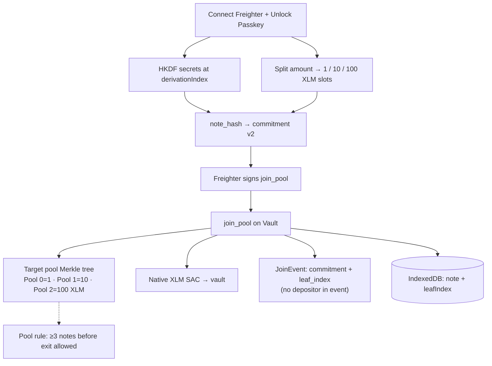
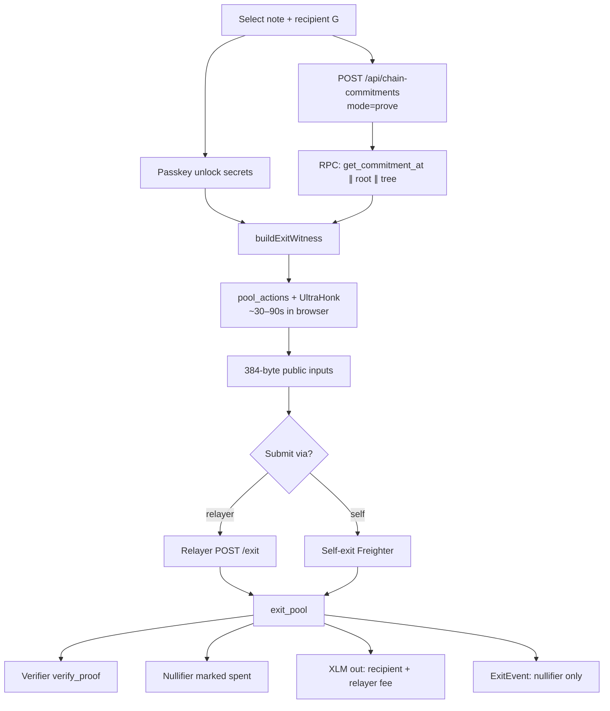
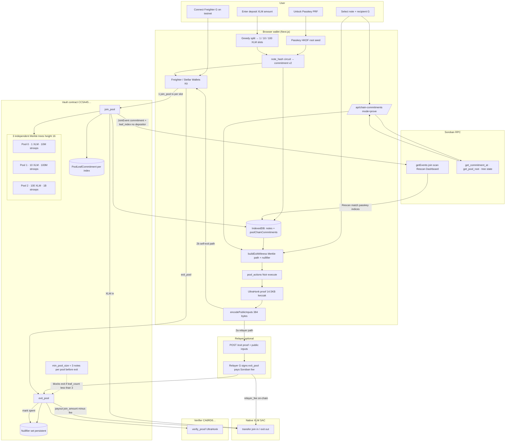

# zk-tornado — Architecture

Deep-dive for reviewers, judges, and contributors. The [README](../README.md) has a one-page summary; this document covers **how each layer fits together**.

**Testnet (Phase B, Real ZK)**

| Contract | ID |
|----------|-----|
| Vault | `CCSA45EVCX3JJDE5OIGJFGWAQPYWD65MMTQZKL66ZILZDMVAUXZXLV4H` |
| UltraHonk verifier | `CA6RD6K36U3QERNRMX6DBDK6ZP2VRSCXSD7MSMLJ22NDAIQWJKQ57CFR` |
| Native XLM SAC | `CDLZFC3SYJYDZT7K67VZ75HPJVIEUVNIXF47ZG2FB2RMQQVU2HHGCYSC` |

---

## 1. System diagram

Full lifecycle: **Connect → Passkey → Deposit → (Rescan) → Exit**. Start with the two focused diagrams below; the [full overview](#full-lifecycle-overview) is at the end of this section.

### Deposit (`join_pool`)



### Exit (`exit_pool` + ZK)



### Full lifecycle (overview)



### Numbered flows (diagram legend)

#### ① Deposit — `join_pool`

| Step | Where | What happens |
|------|--------|--------------|
| 1 | Freighter | User connects **G address** on testnet (tx source is public). |
| 2 | Passkey | **WebAuthn PRF** → root seed → HKDF derives `secret`, `nullifier_secret`, `deposit_secret` at `derivationIndex`. |
| 3 | UI | Whole XLM amount **split** into fixed slots: **1 / 10 / 100 XLM** (one `join_pool` tx per slot). |
| 4 | Browser | `note_hash` circuit: **commitment v2** = Poseidon2(value, secrets, `pool_id`). |
| 5 | Freighter | Signs `join_pool(from, pool_id, commitment)`. |
| 6 | Vault | Pulls fixed **join amount** from user via **native XLM SAC** into vault. |
| 7 | Vault | Inserts commitment into **pool 0 / 1 / 2** Merkle tree → assigns **`leaf_index`**. |
| 8 | Chain | Emits **JoinEvent** `{ pool_id, commitment, leaf_index }` — no depositor in event shape. |
| 9 | IndexedDB | Stores note (secrets + leaf) locally; updates **poolChainCommitments**. |

#### ② Pool rules (on-chain)

| Rule | Detail |
|------|--------|
| **3 pools** | Independent Merkle trees; same secrets in different pools → different commitments (`pool_id` domain separation). |
| **Fixed amounts** | Pool 0 = 1 XLM, Pool 1 = 10 XLM, Pool 2 = 100 XLM (stroops in table §3). |
| **Min pool size** | **`leaf_count ≥ 3`** in that pool required before **`exit_pool`** succeeds (testnet anonymity set). |
| **Tree capacity** | Height **16** → up to ~65k commitments per pool. |

#### ③ Rescan — recover notes after clearing IndexedDB

| Step | Where | What happens |
|------|--------|--------------|
| 1 | RPC | Paginate **`getEvents`** for vault join events (slower; full event window). |
| 2 | Browser | For each join, recompute commitments from passkey indices `0..N` until match. |
| 3 | IndexedDB | Rebuild notes with correct **`leafIndex`** + secrets; optional **recovery passkey**. |

Exit uses **fast path** (`get_commitment_at` parallel, no event scan) — Rescan is only for **note recovery**.

#### ④ Exit — `exit_pool` + ZK proof

| Step | Where | What happens |
|------|--------|--------------|
| 1 | User | Pick **unspent note** + **recipient G** (can differ from deposit wallet). |
| 2 | Passkey | Unlock → resolve note secrets. |
| 3 | API | `POST /api/chain-commitments` **`mode=prove`**: parallel **`get_commitment_at`**, **`get_pool_root`**, tree state for target pool only. |
| 4 | Browser | **buildExitWitness**: verify commitment at leaf; Merkle path; nullifier. |
| 5 | Browser | **`pool_actions`** witness → **UltraHonk** proof (~30–90s); secrets stay local. |
| 6 | Browser | **384-byte public inputs**: `pool_id`, `merkle_root`, nullifiers, zero new_commitments, `public_amount`, `relayer_fee`. |
| 7a | **Relayer** | `POST /exit` → relayer G submits tx, pays Soroban fee, receives **relayer_fee** on-chain. **Tx source ≠ deposit wallet.** |
| 7b | **Self-exit** | User G signs `exit_pool` directly (relayer = self, fee = 0). |
| 8 | Verifier | **`verify_proof`** — invalid or mock proof **reverts**. |
| 9 | Vault | Mark **nullifier spent**; transfer **pool amount − fee** to recipient. |
| 10 | Chain | **ExitEvent** `{ pool_id, nullifier }` — recipient visible in tx args, not in event. |

#### ⑤ What is public vs private

| Public on Stellar | Hidden by ZK / off-chain |
|-------------------|---------------------------|
| Join tx source G | Which leaf / note you own |
| Join commitment + leaf index | `secret`, `nullifier_secret`, `deposit_secret` |
| Exit nullifier | Link deposit ↔ exit inside pool |
| Exit recipient G | — |
| Exit tx source (relayer or self) | Witness and proof generation |
| Pool sizes (anonymity set) | — |

**Privacy property:** observers see joins and exits but cannot link a specific join to a specific exit within a pool (given a large enough anonymity set). Exit **recipient** and **join depositor G** remain public by design on the transparent ledger.

---

## 2. Repository map

| Path | Role |
|------|------|
| `web/` | Next.js wallet — Passkey, IndexedDB, witness + browser proving, Freighter via Stellar Wallets Kit |
| `circuits/pool_actions/` | Main exit proof circuit (UltraHonk) |
| `circuits/note_hash/` | Commitment v2 (Poseidon2 over 5 fields) |
| `circuits/hash_pair/` | Merkle pair hash (matches on-chain + Noir) |
| `contracts/contracts/vault/` | Soroban vault — 3 pools, Merkle trees, nullifiers |
| `contracts/contracts/verifier/` | UltraHonk verifier WASM (Nethermind / Stellar ZK stack) |
| `scripts/relayer/` | Express relayer — submits `exit_pool` on behalf of users |
| `scripts/e2e/` | Testnet E2E — join → prove → exit |
| `artifacts/pool_actions/` | Compiled VK + proof artifacts for deploy |

Circuits are synced into `web/public/circuits/*.json` via `npm run sync:circuits` for browser proving.

---

## 3. Fixed-denomination pools

Three **independent** Merkle trees (height 16, ~65k leaves each):

| `pool_id` | Join / exit amount |
|-----------|-------------------|
| 0 | 1 XLM (10_000_000 stroops) |
| 1 | 10 XLM (100_000_000 stroops) |
| 2 | 100 XLM (1_000_000_000 stroops) |

Depositing 10 XLM creates one note in pool 1. Depositing 23 XLM splits into e.g. 10 + 10 + 1 + 1 + 1 (greedy decomposition in the UI).

**Min pool size (testnet):** exit is rejected until a pool has ≥ 3 notes — encourages a non-trivial anonymity set for demos.

---

## 4. Note format & secrets

### 4.1 Off-chain note (IndexedDB)

```typescript
{
  value: bigint,           // pool denomination in stroops
  poolId: 0 | 1 | 2,
  commitment: "0x…",      // on-chain leaf value
  leafIndex: number,
  secret, nullifierSecret,// BN254 field decimals (strings)
  depositSecretHex,       // 32 bytes → field via mod BN254_FR
  derivationIndex?,       // passkey-derived notes only
  status: "unspent" | "spent"
}
```

Secrets **never** appear on-chain or in the relayer request except inside the ZK proof (which hides the leaf index).

### 4.2 Commitment v2

Noir circuit `note_hash`:

```
commitment = Poseidon2([value, secret, nullifier_secret, deposit_secret, pool_id], 5)
nullifier  = Poseidon2([nullifier_secret, commitment], 2)
```

`pool_id` domain-separates the same secrets across pools (prevents cross-pool replay).

### 4.3 Passkey derivation

WebAuthn **PRF extension** → 32-byte root seed → HKDF labels:

| Label | Output |
|-------|--------|
| `zk-notes/secret/{i}` | `secret` field |
| `zk-notes/nullifier/{i}` | `nullifier_secret` field |
| `zk-notes/deposit/{i}` | 32-byte `deposit_secret` |

Monotonic `derivationIndex` per wallet enables **Rescan**: scan join events, brute-match commitments against indices `0..N` locally in the browser.

**Recovery passkey:** second WebAuthn credential wraps the same logical wallet for cross-device unlock (see `web/src/lib/passkey.ts`).

---

## 5. Merkle tree (on-chain & in-circuit)

### 5.1 Algorithm

Incremental **circomlib-style** tree (`contracts/contracts/vault/src/merkle.rs`):

- Pair hash: `Poseidon2([left, right], 2)` on BN254 scalar field
- Height: **16** (must match `circuits/pool_actions`)
- Each `join_pool` inserts one leaf; `leaf_index = leaf_count` before increment

On-chain storage per pool:

- `MerkleTree { leaf_count, filled[16], zeros[16] }` in instance storage
- Each leaf commitment in persistent `PoolLeafCommitment(pool_id, index)`

### 5.2 Witness in browser

`web/src/lib/merkle-witness-client.ts` rebuilds sibling paths using the same hash as Noir (`hash_pair` circuit in WASM).

**Exit fast path** (`buildChainStateForProve`):

1. `pool_leaf_count`, `get_pool_root`, optional `get_filled_at_level` / `get_zero_at_level`
2. Parallel `get_commitment_at(pool, i)` for all leaves — **no event scan**
3. Dense Merkle witness from full leaf array

**Full sync path** (Rescan, Dashboard): paginate Soroban `getEvents` (~10k ledger window) + merge local notes.

---

## 6. ZK circuit — `pool_actions`

### 6.1 What it proves (exit-only, Phase B)

For each of 4 spend slots (UI uses slot 0 only):

- If `nullifier[i] ≠ 0`: value equals pool join amount; commitment recomputed from secrets; nullifier matches; Merkle path to `merkle_root`
- If `nullifier[i] = 0`: value must be 0

For each of 4 output slots: `new_commitment[j] = 0` (no shielded outputs).

Global constraints:

- `public_amount ≠ 0` (exit, not no-op)
- `relayer_fee ≤ public_amount`
- `sum(spend_values) = sum(out_values) + public_amount` → for exit: one note in, zero out, full denomination withdrawn

### 6.2 Public inputs (384 bytes = 12 × 32)

| Offset | Field | Meaning |
|--------|-------|---------|
| 0 | `pool_id` | 0, 1, or 2 |
| 32 | `merkle_root` | Pool tree root at exit time |
| 64–159 | `nullifier[0..3]` | Active slot has real nullifier; rest `0` |
| 160–255 | `new_commitment[0..3]` | All zero for exit |
| 256 | `public_amount` | Pool denomination (stroops) |
| 288 | `relayer_fee` | Fee deducted on-chain (stroops) |

Encoded identically in:

- `web/src/lib/stellar.ts` → `encodePublicInputs`
- `contracts/contracts/vault/src/verifier.rs` → `encode_public_inputs`
- Noir public input order in `circuits/pool_actions/src/main.nr`

### 6.3 Proof format

- **UltraHonk**, keccak transcript
- **14,592 bytes** (456 × 32) — `PROOF_BYTES` in `web/src/lib/prover-client.ts`
- Real ZK: browser `@aztec/bb.js`; server fallback via `bb prove` + `./scripts/prove_from_witness.sh`
- Mock: 32 bytes `0xab…` — only for MockVerifier deploys; **rejected** on current testnet verifier

---

## 7. Exit flow (step by step)

```
1. User selects unspent note + recipient G address
2. Unlock passkey → resolve note secrets
3. POST /api/chain-commitments { mode: "prove", poolId, reader }
   → leafCount, merkleRoot, commitments[], treeState?
4. buildExitWitness (action-witness.ts)
   → validate commitment at leafIndex
   → Merkle path + nullifier
5. proveWitness → proveSpendInBrowser (Noir execute + UltraHonk)
6a. Relayer: POST /exit { proofHex, publicInputsHex, nullifiers, … }
    → relayer signs exit_pool, pays fee, keeps relayer_fee
6b. Self-exit: wallet signs exit_pool directly (relayer = self, fee = 0)
7. Vault: verify_proof → mark nullifiers spent → transfer XLM to recipient (+ relayer)
```

### 7.1 Vault `exit_pool` (on-chain checks)

After proof verification:

- Compare `public_inputs` to args (pool, amounts, root, nullifiers)
- Reject if nullifier already spent
- `payout = join_amount - relayer_fee` to recipient; `relayer_fee` to relayer address
- Emit `ExitEvent { pool_id, nullifier }` (no recipient in event)

---

## 8. Deposit flow

```
1. deriveAndAllocateNoteSecrets → derivationIndex++
2. computeCommitmentV2 (note_hash circuit in browser)
3. join_pool(from, pool_id, commitment) — Freighter signs
4. Read leaf_count after tx → leafIndex = count - 1
5. Persist note + upsert poolChainCommitments in IndexedDB
```

`JoinEvent` publishes `{ pool_id, commitment, leaf_index }` — **no `from` in event** (privacy-oriented shape; the join tx itself still has a public source account).

---

## 9. Web API surface

| Route | Purpose |
|-------|---------|
| `POST /api/chain-commitments` | Merkle state for exit (`mode=prove`) or full sync (`mode=full`) |
| `POST /api/vault-events` | Event scan + merged commitments (Rescan, Dashboard) |
| `POST /api/prove-witness` | Server-side UltraHonk fallback |
| `POST /api/nullifier-spent` | Check `is_spent` via simulate |
| `POST /api/soroban/prepare`, `/send` | Generic Soroban tx helpers |

All Soroban reads go through server routes because browser CORS cannot call RPC directly in all setups.

---

## 10. Relayer protocol

`scripts/relayer` exposes:

- `GET /info` — relayer G address, default fee
- `POST /exit` — body: `{ poolId, recipient, relayerFeeStroops, nullifierHexes, merkleRootHex, publicInputsHex, proofHex }`

The relayer **does not** receive note secrets or witness — only the proof and public inputs. It learns **recipient** and **fee** (required to submit the payout tx).

Set in `web/.env.local`:

```
NEXT_PUBLIC_RELAYER_URL=http://127.0.0.1:8787
NEXT_PUBLIC_PRIVACY_MODE=strict   # prefer relayer submit
```

---

## 11. Real ZK vs mock

| Flag | Browser | Server fallback | On-chain |
|------|---------|-----------------|----------|
| `NEXT_PUBLIC_ZK_MOCK_PROOF=true` | Mock 32-byte proof | Mock | MockVerifier only |
| `NEXT_PUBLIC_ZK_MOCK_PROOF=false` | Noir + UltraHonk | `bb` required | UltraHonk verifier |

Deploy with `./scripts/deploy_testnet.sh --real-zk` pins VK bytes to the verifier contract.

---

## 12. Phase history (context)

| Phase | Change |
|-------|--------|
| **A** | Removed Send tab from UI |
| **B** | Circuit + contract **exit-only**; removed `shielded_transfer` from product path |
| **C** | Fixed 1/10/100 XLM pools, commitment v2, passkey, relayer exit, min pool size |

Pre–Phase C vaults and notes are **incompatible** (hard cutover).

---

## 13. Known gaps & roadmap

| Gap | Workaround today | Planned |
|-----|------------------|---------|
| Event scan slow for Rescan | Manual rescan only when needed | Tier-2 indexer (SQLite sidecar) |
| Join tx source is public | Relayer only on exit | Join relayer / ASP (Phase D) |
| Exit recipient not in circuit | Trust client / relayer to set recipient | Optional exit hash binding |
| Single relayer | Run your own | Open relay network |
| No audit | Testnet demo only | — |

See [threat model](threat-model.md) for adversary assumptions.

---

## 14. Key files (quick reference)

| Concern | File |
|---------|------|
| Exit witness | `web/src/lib/action-witness.ts` |
| Browser prove | `web/src/lib/prover-client.ts`, `web/src/lib/prove-client.ts` |
| Prove-path chain state | `web/src/server/chain-state.ts` → `buildChainStateForProve` |
| Public inputs | `web/src/lib/stellar.ts` → `encodePublicInputs` |
| Passkey / HKDF | `web/src/lib/root-seed.ts`, `web/src/lib/passkey.ts` |
| Rescan | `web/src/lib/rescan-vault.ts` |
| Circuit | `circuits/pool_actions/src/main.nr` |
| Vault logic | `contracts/contracts/vault/src/lib.rs` |
| Merkle on-chain | `contracts/contracts/vault/src/merkle.rs` |

---

## 15. Verify it yourself

```bash
# Circuits
cd circuits/pool_actions && nargo test

# Contracts
cd contracts && cargo test -p vault

# Browser circuits synced
cd web && npm run sync:circuits && npm run build

# E2E (funded testnet accounts + relayer)
./scripts/e2e_testnet.sh --flow phase-c
```

For demo recording, see [demo-script-en.md](demo-script-en.md).
