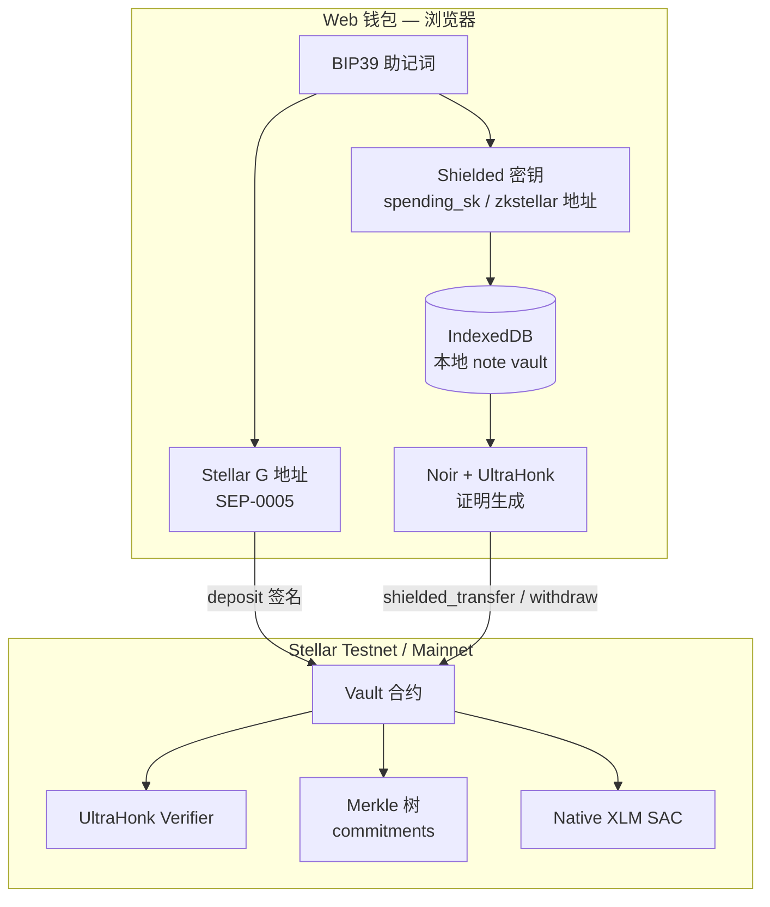
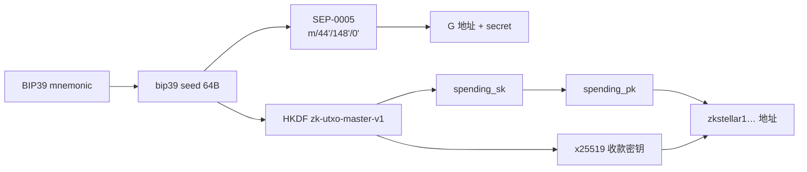
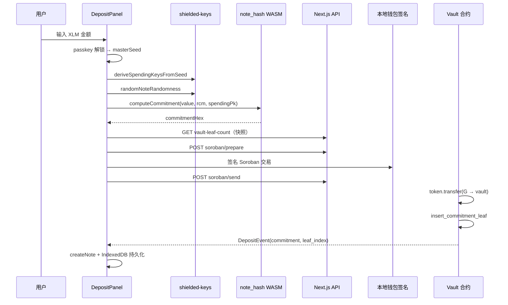
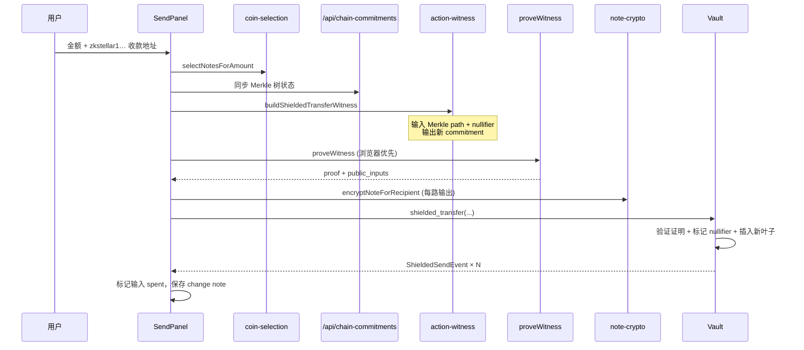
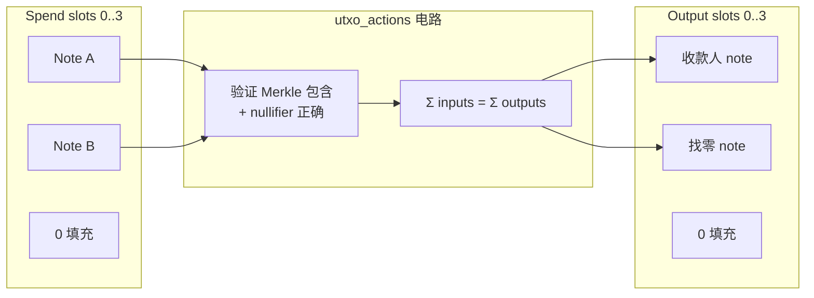
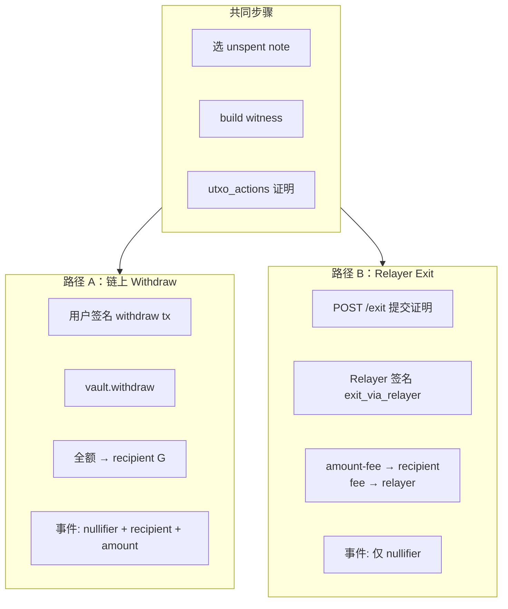
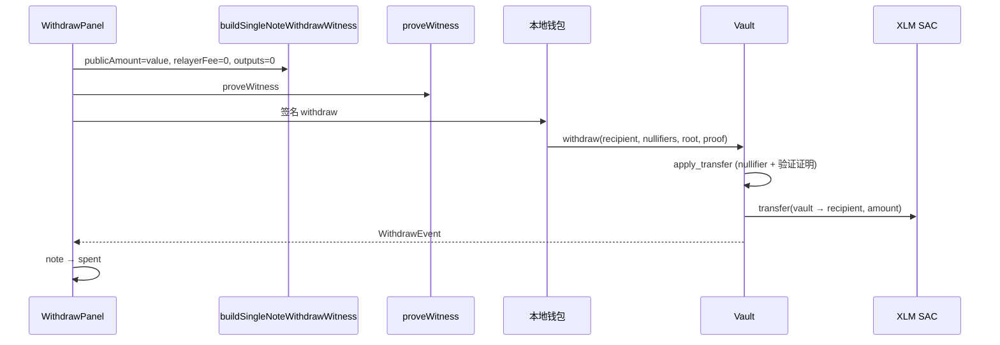
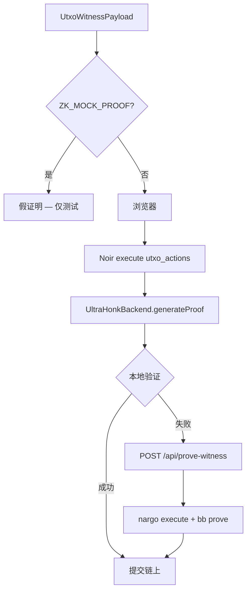

# zk-utxo 技术架构与操作详解

> **语言 / Languages:** [中文](./architecture.md) · [English](./architecture.en.md)

本文档说明 zk-utxo 在 Stellar 上如何实现 UTXO 风格的隐私支付：系统组成、密码学原语、以及 **Deposit / Send / Withdraw** 三条主路径的端到端实现。

---

## 1. 系统概览

zk-utxo 将公开 XLM 存入 Soroban **Vault** 合约，在链上维护一棵全局 **Merkle 承诺树**（高度 16，最多 65536 个叶子）。每个「笔记」（note）对应树中的一个叶子，叶子内容是 **commitment**（承诺值），不暴露金额与所有者。

花费笔记时，证明者提交 **UltraHonk ZK 证明**（`utxo_actions` 电路），合约验证后：
- 将输入的 **nullifier** 标记为已花费（防双花）
- 将新的 commitment 插入 Merkle 树（Send 路径）
- 或向公开 `G…` 地址转出 XLM（Withdraw 路径）


```mermaid
flowchart TB
  subgraph client [Web 钱包 — 浏览器]
    Mnemonic[BIP39 助记词]
    GAddr[Stellar G 地址<br/>SEP-0005]
  Shielded[Shielded 密钥<br/>spending_sk / zkstellar 地址]
    Notes[(IndexedDB<br/>本地 note vault)]
    Prover[Noir + UltraHonk<br/>证明生成]
  end

  subgraph chain [Stellar Testnet / Mainnet]
    Vault[Vault 合约]
    Verifier[UltraHonk Verifier]
    Tree[Merkle 树<br/>commitments]
    SAC[Native XLM SAC]
  end

  Mnemonic --> GAddr
  Mnemonic --> Shielded
  Shielded --> Notes
  Notes --> Prover
  GAddr -->|deposit 签名| Vault
  Prover -->|shielded_transfer / withdraw| Vault
  Vault --> Verifier
  Vault --> Tree
  Vault --> SAC
```

### 1.1 仓库结构

| 目录 | 作用 |
|------|------|
| `circuits/` | Noir 电路：`note_hash`、`hash_pair`、`utxo_actions` |
| `contracts/contracts/vault/` | Soroban Vault：存取款、Merkle 树、nullifier 集合 |
| `contracts/contracts/ultrahonk-verifier/` | 链上 UltraHonk 验证器 |
| `web/` | Next.js 钱包 UI + API + 浏览器内证明 |
| `packages/wallet-core/` | 共享密钥派生与地址编解码 |
| `scripts/e2e/` | 无浏览器端到端测试 |
| `scripts/relayer/` | Relayer 退出 HTTP 服务 |

### 1.2 电路一览

| 电路 | 用途 | 是否需要 ZK 证明 |
|------|------|------------------|
| `hash_pair` | Poseidon2 二元哈希（`spending_pk`、nullifier 等） | 否（浏览器/服务端 execute） |
| `note_hash` | 三元承诺 `Poseidon2(value, rcm, pk)` | 否（Deposit 时本地计算） |
| `utxo_actions` | 4×4 动作束：花费 + 输出 + 公开金额 | **是**（Send / Withdraw） |

---

## 2. 密码学与数据结构

### 2.1 统一助记词

一份 **24 词 BIP39** 同时派生：

- **透明层**：Stellar `G…` 账户（`m/44'/148'/0'`，SEP-0005），用于支付手续费、签名 Soroban 交易
- **隐私层**：shielded master seed（HKDF，与 BIP44 路径隔离），用于 note 密钥与 `zkstellar1…` 收款地址

详见 [key-derivation.md](./key-derivation.md)。


```mermaid
flowchart LR
  MN[BIP39 mnemonic] --> BIP39[bip39 seed 64B]
  BIP39 --> SEP[SEP-0005<br/>m/44'/148'/0']
  BIP39 --> HKDF[HKDF zk-utxo-master-v1]
  SEP --> G[G 地址 + secret]
  HKDF --> SK[spending_sk]
  SK --> PK[spending_pk]
  HKDF --> X25519[x25519 收款密钥]
  PK --> ADDR[zkstellar1… 地址]
  X25519 --> ADDR
```

### 2.2 Note（本地 UTXO）

Note 是钱包本地保存的结构，**完整明文不上链**。

| 字段 | 说明 |
|------|------|
| `value` | 金额（stroops，1 XLM = 10⁷ stroops） |
| `noteRandomness` | 随机数 `rcm`（BN254 域元素） |
| `spendingPk` | 所有者公钥（进入 commitment） |
| `diversifier` | 收款地址多样化索引，自存一般为 `"0"` |
| `commitment` | `0x` 前缀 32 字节十六进制 |
| `leafIndex` | 在全局 Merkle 树中的位置 |
| `status` | `unspent` / `spent` |

定义见 `web/src/lib/note-types.ts`，持久化在 IndexedDB（`zk-utxo:vault:{G地址}`）。

### 2.3 Commitment（链上叶子）

```
commitment = Poseidon2(value, note_randomness, recipient_pk)
```

- `recipient_pk` = 多样化后的收款公钥（`diversifier = 0` 时等于 `spending_pk`）
- 电路实现：`circuits/note_hash/src/main.nr`
- 链上仅存 32 字节 field element

### 2.4 Nullifier（防双花）

```
spending_pk  = Poseidon2(spending_sk, 1)
recipient_pk = diversified_pk(spending_pk, diversifier)
commitment   = Poseidon2(value, rcm, recipient_pk)
nk           = Poseidon2(spending_sk, 2)
nullifier    = Poseidon2(nk, commitment)
```

- 计算 **nullifier 必须持有 `spending_sk`** — 发送方即使知道收款方 commitment，也无法代其花费（Sapling 风格）
- 合约将非零 nullifier 写入已花费集合；重复提交会 `panic!("nullifier spent")`

### 2.5 Shielded 收款地址 `zkstellar1…`

Bech32m 编码（HRP = `zkstellar`），payload 76 字节：

| 部分 | 长度 |
|------|------|
| version | 1 B |
| diversifier | 11 B |
| recipient_pk | 32 B |
| x25519 公钥 | 32 B |

`recipient_pk` 绑定在 ZK 电路的 output commitment 里；`x25519` 仅用于 **链上加密 note 明文**（Send 时收件人解密），不参与电路公开输入。

### 2.6 `utxo_actions` 公开输入（11 × 32 = 352 字节）

```
merkle_root
| nullifier[0..3]       — 4 个花费槽，未用为 0
| new_commitment[0..3]  — 4 个输出槽，未用为 0
| public_amount         — 退出公开金额（Send 时为 0）
| relayer_fee           — Relayer 手续费（Send 时为 0）
```

布局与合约 `contracts/contracts/vault/src/verifier.rs` 一致。证明大小：**456 × 32 = 14,592 字节**（UltraHonk）。

---

## 3. Deposit（存入 / 屏蔽）

将公开 XLM 转入 Vault，换取一条本地 shielded note。**此步骤不需要 ZK 证明**。

### 3.1 流程图


```mermaid
sequenceDiagram
  participant U as 用户
  participant UI as DepositPanel
  participant Keys as shielded-keys
  participant Noir as note_hash WASM
  participant API as Next.js API
  participant W as 本地钱包签名
  participant V as Vault 合约

  U->>UI: 输入 XLM 金额
  UI->>UI: passkey 解锁 → masterSeed
  UI->>Keys: deriveSpendingKeysFromSeed
  UI->>Keys: randomNoteRandomness
  UI->>Noir: computeCommitment(value, rcm, spendingPk)
  Noir-->>UI: commitmentHex
  UI->>API: GET vault-leaf-count（快照）
  UI->>API: POST soroban/prepare
  UI->>W: 签名 Soroban 交易
  UI->>API: POST soroban/send
  V->>V: token.transfer(G → vault)
  V->>V: insert_commitment_leaf
  V-->>UI: DepositEvent(commitment, leaf_index)
  UI->>UI: createNote + IndexedDB 持久化
```

### 3.2 逐步说明

| 步骤 | 实现 |
|------|------|
| 1. 解锁 | `useSecretsStore.unlock()` → BIP39 派生 `masterSeed` |
| 2. 密钥 | `deriveSpendingKeysFromSeed(seed)` → `spendingPk` |
| 3. 随机数 | `randomNoteRandomness()` — 32 字节 mod BN254 标量域 |
| 4. 承诺 | `computeCommitment()` 调用浏览器内 Noir `note_hash` |
| 5. 链上 | `depositOnVault()` → `vault.deposit(from, amount, commitment)` |
| 6. 叶子索引 | 存前后 `leaf_count` 差值得到 `leafIndex` |
| 7. 本地 | `createNote()` + `persistVaultState()` 写入 IndexedDB |

关键文件：
- UI：`web/src/components/DepositPanel.tsx`
- 承诺：`web/src/lib/commitment.ts`
- 交易：`web/src/lib/stellar.ts` → `depositOnVault()`
- 合约：`contracts/contracts/vault/src/lib.rs` → `deposit()`

### 3.3 合约行为 `deposit`

```rust
pub fn deposit(env, from: Address, amount: i128, commitment: BytesN<32>)
```

1. `from.require_auth()` — 存款人必须授权（链上可见签名账户）
2. `token.transfer(from → vault, amount)` — 通过 Native XLM SAC 转账
3. `insert_commitment_leaf(commitment)` — 写入 Merkle 树
4. 发出 `DepositEvent { commitment, leaf_index }` — **不含存款人地址与金额**

### 3.4 隐私特性（Deposit）

| 数据 | 链上 | 本地 |
|------|------|------|
| 存款人 `G…` | **公开**（tx 签名者 + transfer） | — |
| 金额 | transfer 中 **公开** | note 明文 |
| commitment | **公开**（Merkle 叶子） | 镜像 |
| `rcm`, `spending_sk` | 不上链 | **秘密** |

Deposit 仅将资金「装入」隐私池；真正隐藏金额与后续流转依赖 Send/Withdraw 的 ZK 证明。

---

## 4. Send（隐私转账）

在 Vault 内部转移 shielded 余额：**不移动公开 XLM**，只更新 Merkle 树上的 UTXO 集合。需要 **utxo_actions + UltraHonk 证明**。

### 4.1 流程图


```mermaid
sequenceDiagram
  participant U as 用户
  participant UI as SendPanel
  participant CS as coin-selection
  participant Chain as /api/chain-commitments
  participant Wit as action-witness
  participant Prov as proveWitness
  participant Enc as note-crypto
  participant V as Vault

  U->>UI: 金额 + zkstellar1… 收款地址
  UI->>CS: selectNotesForAmount
  UI->>Chain: 同步 Merkle 树状态
  UI->>Wit: buildShieldedTransferWitness
  Note over Wit: 输入 Merkle path + nullifier<br/>输出新 commitment
  UI->>Prov: proveWitness (浏览器优先)
  Prov-->>UI: proof + public_inputs
  UI->>Enc: encryptNoteForRecipient (每路输出)
  UI->>V: shielded_transfer(...)
  V->>V: 验证证明 + 标记 nullifier + 插入新叶子
  V-->>UI: ShieldedSendEvent × N
  UI->>UI: 标记输入 spent，保存 change note
```

### 4.2 4×4 动作束

`utxo_actions` 固定 **最多 4 个输入、4 个输出**，未用槽位用零填充：


```mermaid
flowchart LR
  subgraph inputs [Spend slots 0..3]
    I0[Note A]
    I1[Note B]
    IZ[0 填充]
  end
  subgraph circuit [utxo_actions 电路]
    VERIFY[验证 Merkle 包含<br/>+ nullifier 正确]
    BAL[Σ inputs = Σ outputs]
  end
  subgraph outputs [Output slots 0..3]
    O0[收款人 note]
    O1[找零 note]
    OZ[0 填充]
  end
  I0 --> VERIFY
  I1 --> VERIFY
  VERIFY --> BAL
  BAL --> O0
  BAL --> O1
```

典型 Send：**1~2 个输入 + 1~2 个输出**（收款 + 可选找零）。

| 路径 | `public_amount` | `relayer_fee` | 新 commitment |
|------|-----------------|---------------|---------------|
| Send | `0` | `0` | 1~4 个非零 |
| Withdraw | `note.value` | `0` 或 fee | 全零 |
| Deposit | — | — | 无证明 |

### 4.3 逐步说明

| 步骤 | 实现 |
|------|------|
| 1. 收款人 | `resolveRecipientAddress(zkstellar1…)` → `recipientPk`, `x25519Hex`, `diversifier` |
| 2. 选币 | `selectNotesForAmount()` — 按金额降序贪心，支持精确匹配或找零 |
| 3. 链状态 | `POST /api/chain-commitments` — 重建/校验 Merkle 根与叶子列表 |
| 4. 输出构造 | 收款 output + 可选 change output（回到自己的 `diversifier=0` 地址） |
| 5. Witness | `buildShieldedTransferWitness()` — `web/src/lib/action-witness.ts` |
| 6. 证明 | `proveWitness()` — 浏览器 UltraHonk，失败则 `/api/prove-witness` |
| 7. 加密 | 对每个非零 output：`encryptNoteForRecipient()` — ECDH + 对称加密 note 明文 |
| 8. 提交 | `shieldedTransferOnVault()` → `vault.shielded_transfer(...)` |
| 9. 本地 | 输入标 `spent`；**仅找零 note** 写入本地（收款 note 由收件人扫链解密） |

关键文件：
- UI：`web/src/components/SendPanel.tsx`
- Witness：`web/src/lib/action-witness.ts`
- 证明：`web/src/lib/prove-client.ts`, `web/src/lib/prover-client.ts`
- 加密：`web/src/lib/note-crypto.ts`
- 电路：`circuits/utxo_actions/src/main.nr`

### 4.4 合约行为 `shielded_transfer`

校验 `public_amount == 0` 且 `relayer_fee == 0` 后调用 `apply_transfer()`：

1. 标记 4 个 nullifier（零值跳过）
2. 校验 Merkle 根与链上树一致
3. 调用 UltraHonk Verifier 验证证明
4. 将非零 `new_commitment` 插入树
5. 每个活跃输出发出 `ShieldedSendEvent`（含 `epk` + `encrypted_note`）

**不发生 token.transfer** — XLM 留在 Vault SAC 余额中。

### 4.5 收件人如何收到 note

1. 扫描 `ShieldedSendEvent`
2. 用本地 x25519 私钥尝试解密 `encrypted_note`
3. 得到 `{ value, noteRandomness, spendingPk, diversifier }` 写入本地 vault

---

## 5. Withdraw（取出到公开地址）

花费 shielded note，从 Vault 向公开 `G…` 地址转出 XLM。同样使用 `utxo_actions`，但 **无 shielded 输出**（`new_commitment` 全零），`public_amount = note 全额`。

### 5.1 双路径对比


```mermaid
flowchart TB
  subgraph shared [共同步骤]
    W1[选 unspent note]
    W2[build witness]
    W3[utxo_actions 证明]
  end

  subgraph onchain [路径 A：链上 Withdraw]
    A1[用户签名 withdraw tx]
    A2[vault.withdraw]
    A3[全额 → recipient G]
    A4["事件: nullifier + recipient + amount"]
  end

  subgraph relayer [路径 B：Relayer Exit]
    B1[POST /exit 提交证明]
    B2[Relayer 签名 exit_via_relayer]
    B3[amount-fee → recipient<br/>fee → relayer]
    B4["事件: 仅 nullifier"]
  end

  shared --> onchain
  shared --> relayer
```

| | 链上 Withdraw | Relayer Exit |
|--|---------------|--------------|
| 合约方法 | `withdraw` | `exit_via_relayer` |
| 交易签名者 | 用户 | Relayer |
| `relayer_fee` | `0` | `> 0`（在公开输入中） |
| 链上事件 | 收款人 + 金额 **公开** | 仅 nullifier |
| 适用场景 | 简单直接 | 用户不想自己广播退出 tx |

### 5.2 流程图（链上 Withdraw）


```mermaid
sequenceDiagram
  participant UI as WithdrawPanel
  participant Wit as buildSingleNoteWithdrawWitness
  participant Prov as proveWitness
  participant W as 本地钱包
  participant V as Vault
  participant SAC as XLM SAC

  UI->>Wit: publicAmount=value, relayerFee=0, outputs=0
  UI->>Prov: proveWitness
  UI->>W: 签名 withdraw
  W->>V: withdraw(recipient, nullifiers, root, proof)
  V->>V: apply_transfer (nullifier + 验证证明)
  V->>SAC: transfer(vault → recipient, amount)
  V-->>UI: WithdrawEvent
  UI->>UI: note → spent
```

### 5.3 Witness 形态（单 note 退出）

| 字段 | 值 |
|------|-----|
| `spend_value[0]` | note 全额 |
| `spend_*` 槽 1~3 | 0 |
| `out_*` | 全 0 |
| `public_amount` | note 全额 |
| `relayer_fee` | 0（链上）或 fee（relayer） |
| 余额约束 | `inputSum == public_amount`（无 shielded 输出） |

关键文件：
- UI：`web/src/components/WithdrawPanel.tsx`
- Relayer 客户端：`web/src/lib/relayer-exit.ts`
- Relayer 服务：`scripts/relayer/server.ts`
- Witness：`buildSingleNoteWithdrawWitness` / `buildSingleNoteRelayerExitWitness`

### 5.4 合约行为

**`withdraw`** — 任何人可提交有效证明：

```rust
token.transfer(vault → recipient, public_amount);
WithdrawEvent { nullifier, recipient, amount }
```

**`exit_via_relayer`** — Relayer 必须 `require_auth()`：

```rust
payout = amount - relayer_fee;
token.transfer(vault → recipient, payout);
token.transfer(vault → relayer, relayer_fee);
ExitEvent { nullifier }  // 不含 recipient/amount
```

---

## 6. Merkle 树与链状态同步

- 树高 **16**，与电路 `TREE_HEIGHT` 一致
- 合约：`contracts/contracts/vault/src/merkle.rs` — 增量 Poseidon2 Merkle
- 客户端通过 `POST /api/chain-commitments` 获取：
  - 全量或增量 commitment 列表
  - 当前 `merkleRoot`、`leafCount`
  - 可选 `treeState`（加速 witness 构建）

Witness 构建时对每个输入 note 计算 16 层 sibling path，并断言 `root == 链上 root`。

---

## 7. 证明生成


```mermaid
flowchart TD
  W[UtxoWitnessPayload] --> M{ZK_MOCK_PROOF?}
  M -->|是| D[假证明 — 仅测试]
  M -->|否| B[浏览器]
  B --> N[Noir execute utxo_actions]
  N --> U[UltraHonkBackend.generateProof]
  U --> V{本地验证}
  V -->|失败| S[POST /api/prove-witness]
  S --> CLI[nargo execute + bb prove]
  V -->|成功| OK[提交链上]
  CLI --> OK
```

- 浏览器路径：密钥与 witness **不离开设备**（推荐）
- 服务端路径：`scripts/prove_from_witness.sh` — 开发/降级用
- 电路或 VK 变更后需运行 `./scripts/build_vk_utxo_actions.sh` 并重新部署 Verifier

---

## 8. Web 钱包架构

```mermaid
flowchart TB
  subgraph ui [Next.js App]
    Tabs[Dashboard / Deposit / Send / Withdraw / Notes]
    Connect[Open wallet — 本地解锁]
  end

  subgraph secrets [内存 — 解锁后]
    Seed[masterSeed]
    StellarSK[stellarSecretKey]
  end

  subgraph storage [IndexedDB]
    VaultBlob[encryptedMnemonic + notes + chainCommitments]
    Meta[wallet-meta: active G 地址]
  end

  subgraph apis [API Routes]
    Soroban[/api/soroban/prepare + send]
    Chain[/api/chain-commitments]
    Prove[/api/prove-witness]
  end

  Tabs --> secrets
  Connect --> secrets
  secrets --> VaultBlob
  Tabs --> apis
```

- **一个助记词** → `G…` + shielded 密钥；passkey 加密助记词存 IndexedDB
- **不再依赖** Freighter 等外部 Stellar 插件；签名在本地完成
- Notes 页展示 `zkstellar1…` shielded 收款地址

---

## 9. Vault 合约方法速查

| 方法 | 证明 | Token 流动 | 主要事件 |
|------|------|------------|----------|
| `deposit` | 无 | `user → vault` | `DepositEvent` |
| `shielded_transfer` | 有，`public_amount=0` | 无 | `ShieldedSendEvent` |
| `withdraw` | 有，无新 commitment | `vault → recipient` | `WithdrawEvent` |
| `exit_via_relayer` | 有，relayer 授权 | `vault → recipient + relayer` | `ExitEvent` |
| `get_root` / `leaf_count` | — | — | 只读 |
| `is_spent(nullifier)` | — | — | 只读 |

---

## 10. 隐私模型总结

| 操作 | 链上可见 | 链上隐藏 |
|------|----------|----------|
| Deposit | 存款人、transfer 金额 | 承诺对应的 note 内容 |
| Send | nullifier、新 commitment、加密 note 密文 | 金额、输入输出对应关系（ZK） |
| Withdraw（链上） | nullifier、收款人、金额 | 哪片叶子被花费（ZK） |
| Withdraw（relayer） | nullifier | 收款人、金额（事件层） |

---

## 11. 相关文档

- [English architecture doc](./architecture.en.md)
- [密钥派生](./key-derivation.md)
- [Testnet 部署](./deploy.md)
- [设计规格](./superpowers/specs/2026-06-24-utxo-private-payment-design.md)
- [实现计划](./superpowers/plans/2026-06-24-utxo-implementation.md)
